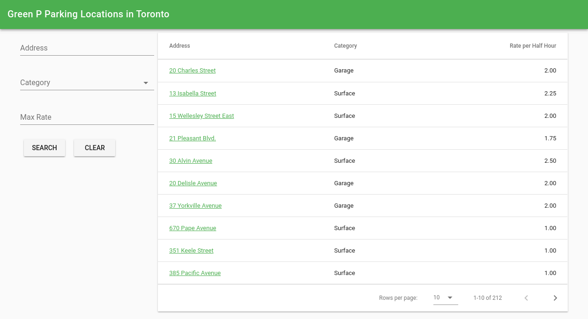

# Vue-Router Vuex Example

> An example application using vue-router with vuex



The app uses the [Green P Parking dataset](https://www.toronto.ca/city-government/data-research-maps/open-data/open-data-catalogue/transportation/#8f2835cf-2312-1fea-1768-93df75cd2de4) from [Toronto Open Data](https://www.toronto.ca/city-government/data-research-maps/open-data/open-data-catalogue/).

For styling the app uses [Vuetify](https://vuetifyjs.com/).

## Build Setup

``` bash
# install dependencies
npm install

# serve with hot reload at localhost:8080
npm run dev

# build for production with minification
npm run build

# build for production and view the bundle analyzer report
npm run build --report
```

For a detailed explanation on how things work, check out the [guide](http://vuejs-templates.github.io/webpack/) and [docs for vue-loader](http://vuejs.github.io/vue-loader).
